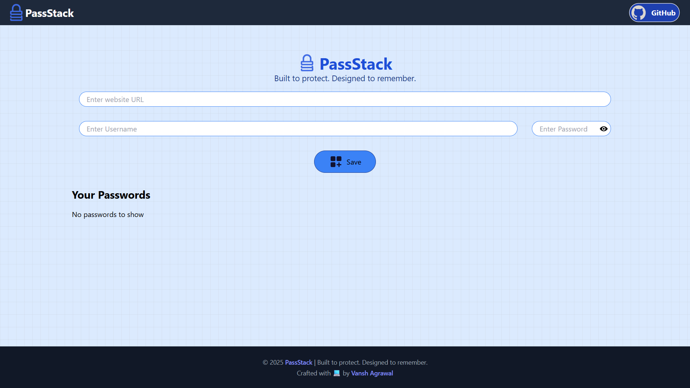

# 🔐 PassStack

**Built to protect. Designed to remember.**

PassStack is a modern and minimal password manager built with React and Tailwind CSS. It securely stores credentials in your browser using `localStorage`, giving you full control — no signups, no servers, just peace of mind.

---

## 📸 Preview



---

## ✨ Features

- 🔐 Save, view, edit & delete passwords  
- 👁️ Toggle password visibility  
- 📋 One-click copy for site, username, or password  
- 💬 Toast notifications for all actions  
- 💡 Input validation to avoid accidental saves  
- 💾 LocalStorage-based offline storage  
- ⚡ Fast and responsive UI (fully mobile-friendly)  
- 🎨 Built with Tailwind CSS + Lordicon animated icons  

---

## 🛠 Tech Stack

- **Frontend**: React 18  
- **Styling**: Tailwind CSS  
- **Build Tool**: Vite  
- **Libraries**:  
  - [React Toastify](https://fkhadra.github.io/react-toastify/)  
  - [UUID](https://www.npmjs.com/package/uuid)  
  - [Lordicon](https://lordicon.com/)

---

## 📁 Project Structure

```
PassStack/
├── public/
│   ├── favicon.png
│   ├── preview.png
│   └── icons/
│       ├── eye.png
│       ├── eyecross.png
│       ├── github.svg
│       └── heart.png
├── src/
│   ├── App.css
│   ├── App.jsx
│   ├── index.css
│   ├── main.jsx
│   ├── assets/
│   │   └── logo.png
│   └── components/
│       ├── Footer.jsx
│       ├── Manager.jsx
│       └── Navbar.jsx
├── .gitignore
├── .eslintrc.cjs
├── index.html
├── package.json
├── package-lock.json
├── postcss.config.js
├── tailwind.config.js
├── vite.config.js
└── README.md
```

---

## ⚙️ Getting Started

### 1. Clone the Repository
```bash
git clone https://github.com/VanshAgrawal52/PassStack.git
cd PassStack
```

### 2. Install Dependencies
```bash
npm install
```

### 3. Start the Development Server
```bash
npm run dev
```

> Open [http://localhost:5173](http://localhost:5173) in your browser

---

## 🙋 Author

Made with 💙 by [Vansh Agrawal](https://github.com/VanshAgrawal52)

---

## 📄 License

This project is licensed under the [MIT License](./LICENSE)

---
